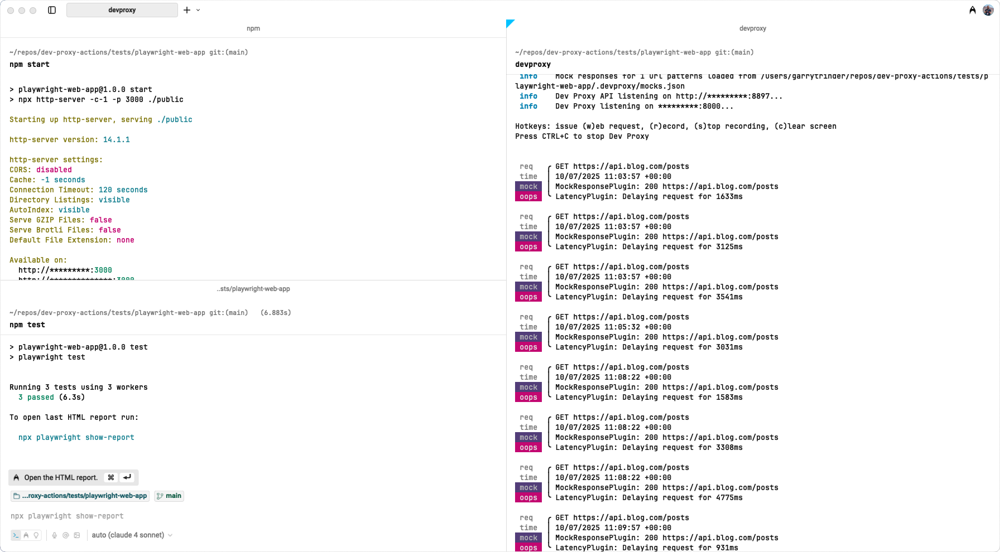
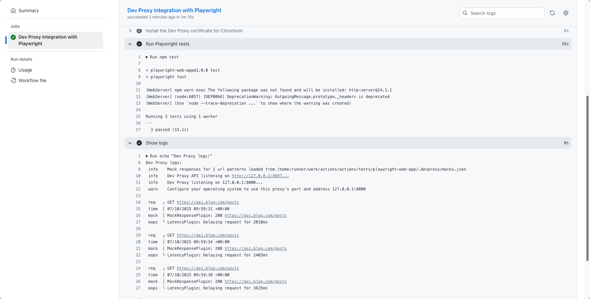

# Playwright Web App

This project is a simple web application designed to demonstrate integration with [Dev Proxy](https://aka.ms/devproxy) and end-to-end testing using [Playwright](https://playwright.dev/).

## Features

- Static web app served from the `public/` directory
- End-to-end tests written with Playwright (`tests/` directory)
- Example Playwright configuration and test scripts
- Easily runnable with minimal setup
- Dev Proxy integration for API mocking and network simulation





## Run locally

1. Install dependencies

    ```sh
    npm install
    ```

1. Install [Dev Proxy](https://aka.ms/devproxy/start)

1. Start Dev Proxy

    ```sh
    devproxy
    ```

    The `.devproxy` folder contains configuration files for [Dev Proxy](https://aka.ms/devproxy), enabling API mocking and network simulation during development and testing.

    - **`devproxyrc.json`**: Main configuration file specifying plugins and settings.
        - **MockResponsePlugin**: Mocks API responses using rules defined in `mocks.json`.
        - **LatencyPlugin**: Simulates network latency with configurable delay.
        - **urlsToWatch**: Only requests to `https://api.blog.com/*` are intercepted.
        - **mockResponsePlugin.mocksFile**: Points to the `mocks.json` file for mock data.
        - **latencyPlugin**: Sets minimum and maximum delay (200–800ms) for responses.
    - **`mocks.json`**: Contains mock API responses. For example, a GET request to `https://api.blog.com/posts` returns a list of blog posts with sample data.

    This setup allows you to run the web app and Playwright tests against consistent, controlled API responses and network conditions, making it ideal for local development and CI environments.

1. Run the web app

    ```sh
    npm start
    ```
   
## Test locally

> [!NOTE] Ensure Dev Proxy is running before executing tests.

1. Install Microsoft Edge for Playwright

    ```sh
    npm run install:msedge
    ```

1. Run Playwright Tests

    ```sh
    npm test
    ```

## Test worfklow locally

This project includes a GitHub Actions workflow (`.github/workflows/test.yml`) to demonstrate testing of Dev Proxy integration with Playwright in CI environments.

**Workflow highlights:**

- Checks out the repository and sets up Node.js 20
- Installs dependencies and Microsoft Edge for Playwright
- Installs and starts Dev Proxy
- Installs the Dev Proxy root certificate for Chromium-based browsers
- Runs Playwright end-to-end tests
- Outputs Dev Proxy logs for troubleshooting

This workflow ensures that your application and tests run in a controlled environment with Dev Proxy, simulating real-world API and network conditions automatically on every run.

To test the workflow locally:

1. Install the [GitHub Local Actions extension](https://marketplace.visualstudio.com/items?itemName=SanjulaGanepola.github-local-actions) in VS Code.
1. If running on macOS with Apple Silicon, set the `container-architecture` option to `linux/amd64` and enable it. [Learn more](https://sanjulaganepola.github.io/github-local-actions-docs/usage/settings/#options).
1. Execute the `Test Dev Proxy integration with Playwright` workflow. [Learn more](https://sanjulaganepola.github.io/github-local-actions-docs/usage/workflows/)